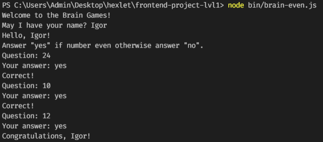
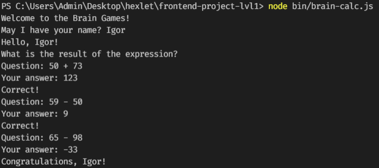
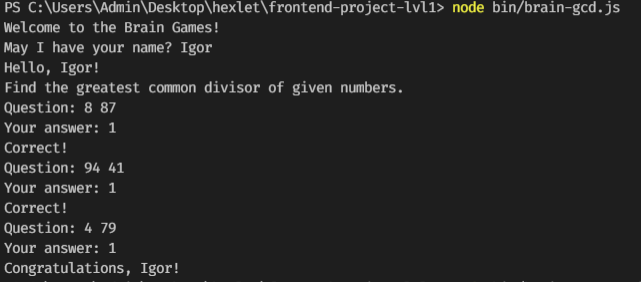
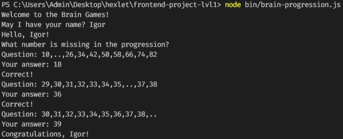
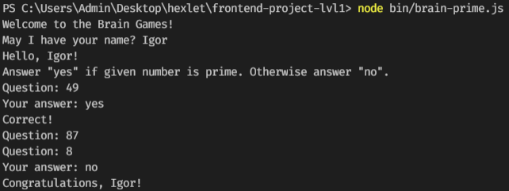

# Игры разума

## Установка

1. `$ git clone https://github.com/Igorg599/frontend-project-lvl1.git`
2. `$ cd fronted-project-lvl1`
3. `$ npm install`
4. `$ npm link`
5. Готово!

## Игры

### Проверка на четность

Запуск игры `$ even-games`

### Калькулятор

Запуск игры `$ calc-games`

### Наибольшой общий делитель (НОД)

Запуск игры `$ gcd-games`

### Арифметическая прогрессия

Запуск игры `$ progression-games`

### Простое ли число?

Запуск игры `$ prime-games`

